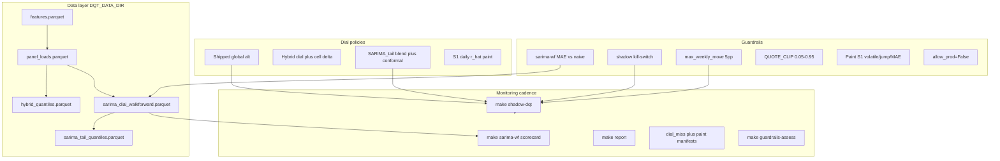

# DQT Tuning — Agentic Playbook

Durable execution guide for **guardrail assessment**, **threshold calibration**, and **monitoring optimization** across the DQT pipeline and daily shadow loop.

**Strategic priority:** attainment first — optimize att50 / ECE / dial_miss; shadow may use higher move thresholds or capped publish; prod keeps stricter ops rails until paint sign-off.

**Related playbooks:** [`.ai/plans/shadow-dqt.md`](.ai/plans/shadow-dqt.md) (daily shadow loop) · [`CLAUDE.md`](CLAUDE.md) (repo commands) · [`README.md`](README.md) (pipeline targets)

---

## Business north star (evidence-backed)

| Objective | Target | Primary evidence |
|-----------|--------|------------------|
| **Global att50** | ~50% on booked TL | Holdout: shipped 46.7% vs **SARIMA_tail 50.3%** (`data/results/sarima_walkforward_scorecard.parquet`) |
| **Calibration (ECE)** | Minimize grid AAD | SARIMA_tail **2.72pp** best on holdout |
| **Dial miss** | Reduce book-date miss | Exec readout: mean **3.2pp** dial_miss; dial explains **~86%** of etp50 shift variance ([`documentation/etp-slider/dqt-dial-miss-exec-readout.md`](documentation/etp-slider/dqt-dial-miss-exec-readout.md)) |
| **Broker UX (volatile ETP)** | ↓ volatile rate without MAE blow-up | Paint Stage 1 gates: −15% volatile or −30% daily jump ([`sarima_daily_paint.py`](src/dqt/etp_slider/paint/sarima_daily_paint.py)) |
| **Ops trust** | No surprise 8pp+ global jumps in prod | Shipped dial history: **>5pp moves on 0.4%** of weekdays (538 pairs) |

**Leading candidate stack:** `SARIMA_tail` load-level $ + global row from [`global_alts_from_tail`](src/dqt/sarima_dial.py) for shadow SF.

---

## System map



---

## Guardrail census (assess every row)

| ID | Gate | Location | Default | Calibrated? | Empirical fire rate (current) | Business role |
|----|------|----------|---------|-------------|-------------------------------|---------------|
| **G1** | Dial MAE vs naive | [`build_sarima_walkforward.py`](scripts/build_sarima_walkforward.py) | sarima_cal < naive | Partially (holdout) | Fails rarely when SARIMA healthy | Block $ materialization if model broken |
| **G2** | Kill-switch (MAE + min lift) | [`sarima_publish.py`](src/dqt/sarima_publish.py) | fail if MAE ≥ naive | No formal backtest | Low when G1 passes | Shadow publish fallback to shipped |
| **G3** | **Weekly move** | [`global_dqt.py`](src/dqt/model/global_dqt.py) `_DEFAULT_MAX_WEEKLY_MOVE=0.05` | 5pp any level | **Yes** (2026-09-01 backtest) | **Shipped: 0.4%**; **SARIMA_tail: 27%** (60d quick) | Prod ops safety; **blocks attainment in shadow** |
| **G4** | Quote clip | [`QUOTE_CLIP_DEFAULT`](src/dqt/sarima_dial.py) | [0.05, 0.95] | Yes (WM grid) | N/A | Prevent pathological left-tail $ |
| **G5** | Hybrid δ cap | [`cap_weekly_delta`](src/dqt/hybrid.py) | **off** (`max_weekly_delta=None`) | Not used in default HybridConfig | N/A | Model for **capped global publish** |
| **G6** | Paint Stage 1 | [`evaluate_stage1_gates`](src/dqt/etp_slider/paint/sarima_daily_paint.py) | −15% vol OR −30% jump + MAE slack | Experiment-driven | Per S0–S3 manifest | LC volatile cohort UX |
| **G7** | Paint Stage 2 | same | MAE slack $15 @48hr | Experiment-driven | Per manifest | Fidelity vs S1 |
| **G8** | Settlement lag | [`ShadowDQT`](src/dqt/shadow_dqt.py) | 3d | Proxy only | N/A | Which booked day is “complete” |
| **G9** | Prod FQN block | [`GlobalDQT.publish`](src/dqt/model/global_dqt.py) | `allow_prod=False` | Policy | N/A | Never accidental prod write |
| **G10** | ETP problem-load gate | drift/cat scripts | scaled 10% × ETP50 | Yes (canonical cohort) | Separate workstream | Slider analytics, not dial publish |

**Key finding:** G3 at 5pp matches **prod behavior** but conflicts with **attainment-first SARIMA_tail** (median blend shift 3.0pp, p90 7.7pp on 60d eval). This is the primary tuning lever.

---

## Dial / policy census

| Policy | Artifact | Granularity | Best for | Monitoring |
|--------|----------|-------------|----------|------------|
| Shipped DQT | SF `HISTORICAL_ETP_DYNAMIC_QUANTILES` | Global `alt_*` | Production baseline | `GlobalDQT.history`, daily shadow scored KPIs |
| Hybrid | `hybrid_quantiles.parquet` | Load $ + cell δ | Holdout CRPS | Weekly report |
| SARIMA_pp | `sarima_pp_quantiles.parquet` | Load $ rigid | Dial center only | sarima-wf scorecard |
| SARIMA_blend | `sarima_blend_quantiles.parquet` | Load $ | CRPS leader | sarima-wf scorecard |
| **SARIMA_tail** | `sarima_tail_quantiles.parquet` | Load $ | **att50 + ECE leader** | **shadow-dqt daily** |
| S1 daily paint | paint experiment parquets | Per-load timeline | LC volatile / dial_miss | `run_sarima_paint_experiment.py` |

---

## Calibration (empirical, 2026-09-01)

Run: `DQT_DATA_DIR=data make guardrails-assess QUICK=1`  
Artifacts: `data/tuning/guardrail_assessment_2026-09-01.{md,parquet}`

### Shipped dial weekday moves (538 pairs)

| Stat | Value |
|------|-------|
| alt_50 median move | **0.27pp** |
| max-level p90 | **0.94pp** |
| >5pp exceed rate | **0.4%** |
| >8pp exceed rate | **0.0%** |

Prod dial moves are very slow — 5pp matches historical ops.

### SARIMA_tail proposal moves (60 weekdays, quick mode)

| Stat | Value |
|------|-------|
| alt_50 median move | **3.01pp** |
| max-level p90 | **7.70pp** |
| >5pp exceed rate | **26.7%** |
| >8pp exceed rate | **10.0%** |
| >10pp exceed rate | **3.3%** |

At 10pp gate, ~97% of recent eval days would pass (only 3.3% exceed). **Capped publish at 5pp/day** captures gradual catch-up without blocking SF entirely.

### Recommended thresholds (attainment-first)

| Environment | `max_weekly_move` | `publish_mode` | Rationale |
|-------------|-------------------|----------------|-----------|
| **Prod SF** | 5pp (unchanged until paint sign-off) | `block` | Matches historical ops; never >8pp day-over-day |
| **Shadow SF (RARKO)** | **10pp** provisional, or **5pp cap/day** | **`cap` preferred** | Captures ~97% of eval days at 10pp; cap tracks gradual catch-up |
| **Research audit** | none (`full`) | Always log full proposal | Never hide signal in staging parquet |

Shadow CLI (wired):

```bash
# Default prod-style block at 5pp
DQT_DATA_DIR=data make shadow-dqt SKIP_SF=1

# Shadow workspace: capped publish at 5pp/day
DQT_DATA_DIR=data make shadow-dqt MAX_WEEKLY_MOVE=0.05 PUBLISH_MODE=cap

# Higher gate for scientist sign-off
DQT_DATA_DIR=data make shadow-dqt MAX_WEEKLY_MOVE=0.10 PUBLISH_MODE=block
```

---

## Phased work packages

### P0 — Playbook + guardrail registry ✅

- This document replaces chat fragments in `dqt-tuning.md`.
- Cross-links: shadow playbook, CLAUDE.md, README.

### P1 — Automated guardrail assessment ✅

Thin CLI over [`src/dqt/tuning/assess.py`](src/dqt/tuning/assess.py):

```bash
uv run python scripts/assess_dqt_guardrails.py --data-dir data
DQT_DATA_DIR=data make guardrails-assess QUICK=1   # ~3 min, last 60 weekdays
```

Outputs:

1. Shipped move distribution from `dqt_alt_percentiles.parquet`
2. SARIMA_tail proposal moves via `global_alts_from_tail` loop
3. Fire rates at 3/5/8/10/12pp
4. G1/G2 kill-switch alignment

### P2 — Shadow threshold knobs ✅

- `--max-weekly-move` and `--publish-mode {block,cap,full}` on [`scripts/shadow_dqt_daily.py`](scripts/shadow_dqt_daily.py)
- `cap` uses [`cap_global_alts`](src/dqt/tuning/assess.py) (prior + clip(Δ, ±τ)) before gates
- Makefile: `MAX_WEEKLY_MOVE`, `PUBLISH_MODE`

### P3 — Monitoring cadence

#### Daily (ops monitor)

`make shadow-dqt` — alert on:

| Condition | Action |
|-----------|--------|
| `kill_switch_passed=false` | Exit 2; fallback to shipped; no SF |
| `gates_passed=false` and \|Δalt_50\| > 5pp | Review staging parquet; consider `PUBLISH_MODE=cap` |
| `tail_att50` vs `shipped_att50` divergence > 3pp on scored day | Flag in weekly review |

Artifacts: `data/shadow/shadow_eval_history.parquet`, `data/staging/dial_proposal_*`.

#### Weekly (research scorecard)

```bash
make sarima-wf APPEND=1          # extend dial + rematerialize tail
# review data/results/sarima_walkforward_scorecard.parquet
make report                      # if weekly Streamlit report enabled
```

#### Monthly (guardrail review)

```bash
DQT_DATA_DIR=data make guardrails-assess
# review data/tuning/guardrail_assessment_*.md
```

Update **Guardrail census** fire-rate column when thresholds or model change.

#### Quarterly (strategy)

- Re-run [`scripts/run_dial_miss_decomposition.py`](scripts/run_dial_miss_decomposition.py)
- Re-run [`scripts/run_sarima_paint_experiment.py`](scripts/run_sarima_paint_experiment.py) on canonical 7–14d cohort
- Update § Calibration threshold table

### P4 — Performance optimization

| Bottleneck | Fix |
|------------|-----|
| `global_alts_from_tail` in loops | `--quick` samples 60d; full run ~3.5 min |
| Full tail rematerialize on APPEND | Keep `APPEND=1` path; document `data/current` vs `data` layer |
| Shadow `score_day` | Pre-filter panel by `booked_date` before tail join |
| Gate assessment runtime | `--quick` for monthly cadence; full for quarterly |

### P5 — Prod path decision (document only until sign-off)

1. If Paint S1 passes **and** capped shadow att50 within 1pp of full tail for 30 consecutive weekdays → propose prod `max_weekly_move=8pp` trial.
2. If dial_miss exec readout confirms S1 > static shipped → prioritize **paint productization** over global dial jumps.
3. Never remove G1/G2 kill-switch.

---

## Happy-path commands (scientist)

```bash
# 1. Refresh layer (full fit or live)
DQT_DATA_DIR=data make features FORCE=1   # or data/current + APPEND
DQT_DATA_DIR=data make hybrid FORCE=1
DQT_DATA_DIR=data make sarima-wf APPEND=1

# 2. Daily shadow monitor
DQT_DATA_DIR=data make shadow-dqt SKIP_SF=1   # audit-only
DQT_DATA_DIR=data make shadow-dqt MAX_WEEKLY_MOVE=0.10 PUBLISH_MODE=cap

# 3. Guardrail assessment
DQT_DATA_DIR=data make guardrails-assess QUICK=1

# 4. Strategy readouts
uv run python scripts/run_dial_miss_decomposition.py --data-dir data
uv run python scripts/run_sarima_paint_experiment.py --avail-start '2025-01-01' --avail-end '2026-08-28'
```

---

## Agent checklist (per change)

- [ ] Every guardrail change updates the **Guardrail census** table with new default + backtest fire rate
- [ ] Attainment impact quantified on holdout (att50, ECE, dial_miss_pp) before prod threshold change
- [ ] Shadow and prod thresholds documented separately
- [ ] `make test` + `make lint` pass
- [ ] No duplicate `DQT_DATA_DIR` in `.env` (Make vs python-dotenv mismatch)
- [ ] zsh: quote ISO dates in CLI args

---

## Definition of done (program level)

- `dqt-tuning.md` is the canonical tuning playbook (no chat fragments).
- `assess_dqt_guardrails.py` produces reproducible fire-rate + threshold recommendations.
- Shadow supports `--max-weekly-move` and `--publish-mode`; capped publish closes blocked-day gap vs status quo.
- Daily shadow + weekly scorecard + monthly guardrail review documented with alert conditions.
- Prod `max_weekly_move` unchanged until P5 sign-off; attainment gains captured in shadow/RARKO first.
